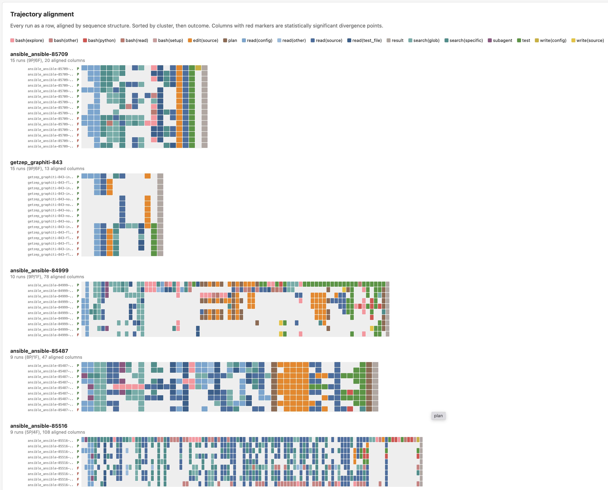
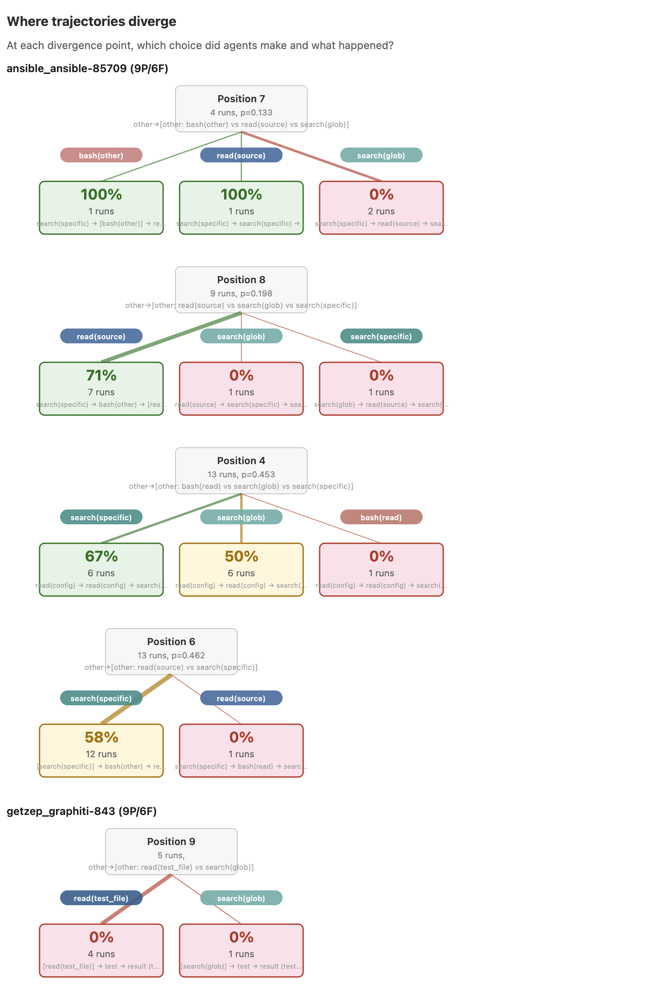

# moirai

Find where agents actually go wrong.

Given 100+ runs of the same task, moirai aligns trajectories and identifies the exact decision points where behavior diverges — and whether those choices predict success or failure.

```
                       ┌─ read(config) → read(test_file) ─── success (100%)
                       │
run 1─┐                │
run 2─┼─ read(source) ─┤
run 3─┤                │
run 4─┘                └─ bash(python) → bash(python) ───── failure (0%)
                       │
                       divergence point (p=0.001)
```

## The core idea

Agent failures aren't random. When you run the same task 100 times, outcomes cluster into a small number of recurring behavioral branches.

moirai finds those branches.

It treats each run as a sequence of steps (tool calls, reasoning turns, test executions), aligns them using Needleman-Wunsch, and tests where different choices lead to different outcomes. Instead of reading 100 traces, you get:

- **where** trajectories split
- **what choices** lead to success vs failure
- **which patterns** actually matter

```
Without moirai:                      With moirai:
  165 runs                             2 dominant branches
  19% pass rate                        branch A: read → subagent → search → success (100%)
  unclear why                          branch B: edit → bash(python) → loop → failure (0%)
                                       divergence happens around step 15
```

## Example: 165 eval-harness runs (19% baseline success)

### Where trajectories split

```
$ moirai branch runs/ --harness none

Cluster 4: 47 runs, 19% success
  Aligned to 110 columns, 1 significant divergence point

  Position 55 (p=0.100)
    bash(python):  3 runs, 0% success
    context: ...read(source) → read(source) → read(source) → [bash(python)] → bash...
    read(config):  2 runs, 100% success
    context: ...read(config) → read(test_file) → [read(config)]...
```

After reading source files, agents that run python scripts (executing code without testing the fix) always fail. Agents that go back to the config and test files always succeed. Same cluster, same task distribution, same starting conditions — the outcome is determined by what the agent does at this fork.

### Patterns that predict success and failure

```
$ moirai patterns runs/ --harness none

Patterns that predict success (baseline: 19%):
  read(source) → subagent → search(glob) → search(glob)   100% (6 runs)  p=0.000
  search(glob) → read(source) → subagent → search(glob)   100% (4 runs)  p=0.001
  read(config) → read(other) → read(test_file)            100% (5 runs)  p=0.000

Patterns that predict failure:
  read(source) → edit(source) → bash(python)                 0% (11 runs)  p=0.128
  read(source) → read(source) → read(source) → bash(other)  0% (15 runs)  p=0.076
  bash(python) → test → bash(python)                         0% (16 runs)  p=0.044
  bash(python) → bash(python) → bash(python)×5               0% (13 runs)  p=0.131
```

The success patterns: read source, delegate to a subagent, do broad then targeted search. The agent that understands the structure before editing succeeds. The failure patterns: edit source then run python (testing the code instead of running the test suite), or looping on bash commands without progress. The stuck agent runs python over and over — 0% success rate across 16 runs.

### What agents actually did

```
$ moirai clusters runs/ --harness none

Cluster 4: 47 runs, 19% success
  48% explore, 27% execute, 12% verify, 7% modify
    normal (40 runs, 18%): read(config) → search(glob)×2 → read(source) → subagent →...
    retry loop (7 runs, 29%): read(config) → search(glob)×2 → read(source) → subagent →...

Cluster 3: 35 runs, 17% success
  60% explore, 12% modify, 9% execute, 9% verify
    normal (30 runs, 20%): search(glob) → search(specific) → read(source) → edit(source)...
    retry loop (5 runs, 0%): read(config) → search(glob)×2 → read(source) → search(glob)...
```

### Explain any specific run

```
$ moirai explain runs/ --run ansible_ansible-85488

Run: ansible_ansible-85488... PASS
Cluster: 3 (118 runs, 11% success)

Trajectory: read(config)×2 → search(specific)×2 → read(source)×2 →
            search(specific) → read(source) → search(glob) → search(specific) →
            read(other) → read(config) → edit(source)×3 → read(source) → test → result
Mix: 76% explore, 14% modify, 5% verify

Compared to failing runs in this cluster (105):
  avg 20 steps (vs 21 in this run)
```

This run spent 76% of its steps exploring (reading, searching) before making 3 targeted edits. The 105 failing runs in the same cluster averaged the same length — the difference wasn't effort, it was strategy.

### HTML report

`moirai branch --html report.html` generates a per-task analysis. Each task with mixed outcomes gets aligned trajectories and decision trees showing where runs diverged:

**Per-task trajectory alignment** — repeated runs of the same task, aligned by step sequence. Pass runs on top, fail runs below. Each cell is an enriched step (file type, command type, search specificity).



**Divergence decision trees** — at each statistically significant fork, which step did agents choose and what happened? Node size proportional to run count, color by outcome.



Each task also gets a **narrative finding** explaining what happened at the fork in plain language, with full trajectories and actual file names/commands inline.

## What you can do with this

- Detect failure modes that recur across runs
- Identify early decisions that dominate outcomes
- Turn behavioral patterns into monitoring rules
- Focus interpretability on the 2-3 decisions that actually matter
- Compare harness or model changes at the trajectory level, not just pass rate

## Why existing tools miss this

**Aggregate metrics** tell you *that* 19% of runs pass but not *whether* they all fail the same way or five different ways.

**Trace viewers** show you one run at a time. If you're running 100 agents on the same task, reading individual traces doesn't scale.

**Pass/fail thinking** treats each run as an independent coin flip. But agent behavior is structured — the question isn't "did it pass" but "which branch did it take?"

moirai operates at the layer between individual traces and aggregate metrics: structural analysis of trajectory populations.

## Why this matters

### For interpretability
Trajectory alignment identifies *where* in a rollout interpretability is most useful. Instead of reasoning about every token across a 50-step trajectory, you can focus on the 2-3 aligned positions where the agent's choice statistically predicts success or failure. These divergence points are where the model's decision-making actually matters — and where mechanistic analysis has the highest leverage.

### For agent monitoring
Recurring failure branches are more useful than raw anomaly detection on individual traces. If your failing runs share the structural pattern `read(source) → edit(source) → bash(python)` at 0% success, that's a detector you can build and deploy — not a one-off incident to investigate. moirai gives you the recurring behavioral signatures, not just the individual alerts.

### For simulation and environment design
Divergence points reveal which environment choices or early decisions dominate downstream outcomes. If agents that read the test file at step 16 succeed 100% while those that run bash(python) succeed 0%, that's a signal about environment design — not just agent capability. Trajectory alignment separates "the agent made a bad choice" from "the environment presented a hard fork."

## What this is not

- **Not a trace viewer.** moirai doesn't visualize individual runs. It analyzes populations of runs.
- **Not a benchmark harness.** It doesn't run agents or compute pass/fail. It takes existing traces as input.
- **Not a generic analytics dashboard.** There are no time-series charts, percentile breakdowns, or cost summaries. The only question moirai answers is: *where do trajectories diverge, and does it matter?*
- **Not a replacement for interpretability tools.** It doesn't look at model internals, attention patterns, or activations. It works at the behavioral level — what the agent *did*, not what it *computed*.

What it is: a way of treating stochastic rollouts as structured sequences, aligning them, and finding the recurring behavioral branches that statistically predict outcomes.

## Install

```bash
pip install -e .
```

Requires Python 3.11+.

## Commands

```bash
moirai validate path/to/runs/           # check trace files
moirai summary path/to/runs/            # aggregate stats
moirai trace path/to/run.json           # inspect one run
moirai clusters path/to/runs/           # find behavioral modes
moirai branch path/to/runs/             # find divergence points
moirai patterns path/to/runs/           # find success/failure patterns
moirai explain path/to/runs/ --run ID   # explain a specific run
moirai diff path/to/runs/ --a K=V --b K=V  # compare cohorts
```

All directory commands support `--model`, `--harness`, `--task-family` filters.

## How it works

1. **Normalize** — loads JSON trace files, enriches step labels from attrs (file type, command type, search specificity)
2. **Cluster** — pairwise Needleman-Wunsch edit distance over step sequences, agglomerative clustering
3. **Align** — progressive multi-sequence alignment within each cluster at enriched-name level
4. **Test** — Fisher's exact test at each aligned position; filters by significance (p<0.2) and stability (min 2 runs per branch)
5. **Mine** — extracts 3-5 step n-grams, tests which patterns discriminate between success and failure

## Data format

Each JSON file is one run. Step types: `llm`, `tool`, `system`, `memory`, `compaction`, `judge`, `error`, `handoff`. Steps with `attrs` (file paths, commands, search patterns) get enriched labels automatically. Converters included for [SWE-smith](scripts/convert_swe_smith.py) and [eval-harness](scripts/convert_eval_harness.py) formats.

## Limitations

moirai works on behavioral sequences — what the agent *did*, not what it *thought*. The patterns it finds are structural correlations, not causal explanations. "Runs that loop on bash(python) fail" might mean "stuck agents thrash with python scripts," not "python scripts cause failure." Richer traces (with reasoning content, error messages, and file context) would enable deeper analysis. The enriched labels from attrs help but don't close this gap entirely.

## Roadmap

- Content-aware analysis (what the agent read/wrote, not just which tool it called)
- Semantic step grouping beyond tool names and file extensions
- Time-series drift detection across nightly runs
- OpenTelemetry adapters
