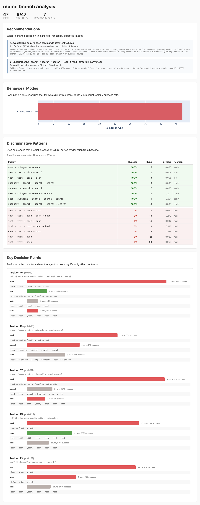

# moirai

Trajectory-level debugging for stochastic agent systems.

## The problem

Agent evaluations report final metrics — pass rate, score, cost. But when 25% of runs fail, those numbers don't tell you whether they all fail the same way or five different ways. When a harness change improves pass rate, you can't tell if it fixed the failure mode or just shifted it. Final metrics are lossy summaries of rich behavioral data.

moirai looks at the *trajectories* — the sequence of steps each run took — and shows you where behavior diverges and how divergence correlates with outcome.

## Example: 1000 SWE-smith trajectories

### What patterns predict failure?

```
$ moirai patterns runs/

Discriminative patterns (1000 runs, 75% baseline success)

Patterns correlated with success:
  edit → test_result → write → test_result → reason  100% success (12 runs) vs 75% baseline  p=0.044
  write → edit → reason                              100% success (13 runs) vs 75% baseline  p=0.047

Patterns correlated with failure:
  write → test_result → read → read → test_result    0% success (4 runs) vs 75% baseline    p=0.004
  read → read → read → test_result                   17% success (6 runs) vs 75% baseline   p=0.005
  reason → test_result → reason → test_result → reason  20% success (5 runs) vs 75% baseline  p=0.016
```

### How do runs cluster?

```
$ moirai clusters runs/

Cluster 18: 149 runs, 85% success
  explore → verify(fail) → explore → verify(fail) → modify → verify(fail)×2
  43% verify, 31% modify, 19% explore, 5% think
    normal (143, 85%, ~32 steps): read → test(fail) → write → edit → test(fail) → write → t...
    retry loop (6, 83%, ~40 steps): read → write → edit → write → test(fail)×4 → write×2

Cluster 25: 116 runs, 77% success
  explore → verify(fail)×2 → modify → verify(fail)×2 → think → verify(fail)
  61% verify, 20% modify, 13% explore, 4% think
    normal (116, 77%, ~35 steps): read → test(fail)×5 → write → edit → test(fail) → read → ...
```

### Where do trajectories diverge?

```
$ moirai branch runs/

Cluster 18: 149 runs, 85% success
  Aligned to 27 columns, 1 divergence points

  Position 23 (entropy 0.46, p=0.180)
  verify→
    test_result: 112 runs, 88% success
    context: ...test_result → test_result → [test_result] → write...
    write: 5 runs, 60% success
    context: ...test_result → [write] → write...
    read: 4 runs, 75% success
    context: ...test_result → [read] → reason...

Cluster 13: 109 runs, 74% success
  Aligned to 55 columns, 1 divergence points

  Position 35 (entropy 0.17, p=0.075)
  verify→
    test_result: 77 runs, 74% success
    search: 2 runs, 0% success
```

### Why did this run fail?

```
$ moirai explain runs/ --run Project-MONAI

Run: Project-MONAI__MONAI.a09c1f08... FAIL
Cluster: 23 (5 runs, 40% success)

Trajectory: read → search → test(fail)×2 → reason → test(fail) → write → reason → edit → test(fail)×2 → write → test(fail) → test(pass) → reason
Phases: explore×2 → verify(fail)×2 → think → verify(fail) → modify → think → modify → verify(fail)×2 → modify → verify(fail) → verify(pass) → think
Mix: 47% verify, 20% think, 20% modify, 13% explore

Compared to cluster:
  In passing runs from this cluster (2):
    avg 30 steps (vs 29 in this run)
    e.g. read → search → test(fail) → write → test(fail) → reason → write → ...
```

### HTML dashboard

`moirai branch` generates an interactive HTML dashboard with recommendations, patterns, and decision points:



## Install

```bash
pip install -e .
```

Requires Python 3.11+.

## Quickstart

```bash
# validate trace files
moirai validate path/to/runs/

# aggregate stats
moirai summary path/to/runs/

# inspect a single run
moirai trace path/to/run.json

# cluster by trajectory structure
moirai clusters path/to/runs/

# find where trajectories diverge
moirai branch path/to/runs/

# find patterns that predict success/failure
moirai patterns path/to/runs/

# explain why a specific run failed
moirai explain path/to/runs/ --run <run_id>

# compare two cohorts
moirai diff path/to/runs/ --a harness=baseline --b harness=router
```

## Commands

| Command | Description |
|---------|-------------|
| `validate` | Check JSON validity and schema compliance |
| `summary` | Aggregate stats across runs |
| `trace` | Inspect a single run with compressed trajectory |
| `clusters` | Cluster runs by trajectory structure, show sub-patterns |
| `branch` | Per-cluster divergence analysis with significance testing |
| `patterns` | Find step patterns that predict success or failure |
| `explain` | Explain why a specific run succeeded or failed |
| `diff` | Compare two cohorts |

### Common flags

- `--strict` — treat warnings as errors
- `--html <path>` — write HTML dashboard (branch, clusters, diff)
- `--model`, `--harness`, `--task-family` — filter runs

### Diff flags

`--a` and `--b` take `K=V` filters, repeatable:

```bash
moirai diff runs/ --a harness=baseline --a model=claude-3.7 --b harness=router
```

## Output format

moirai compresses raw step sequences into readable summaries:

**Raw** (28 steps): `error_observation → read → error_observation → action → ...`

**Compressed** (8 tokens): `read×2 → edit → write → test(fail) → search → test(fail) → read`

**Phase level**: `explore → modify → verify(fail) → explore → verify(fail) → explore`

**Phase mix**: `50% verify, 25% modify, 25% explore`

## Data schema

Each JSON file is a single run object:

```json
{
  "run_id": "run_001",
  "task_id": "task_bugfix_123",
  "task_family": "bugfix",
  "agent": "swe_agent",
  "model": "claude-3.7-sonnet",
  "harness": "baseline_v1",
  "timestamp": "2026-03-24T12:00:00Z",
  "tags": {"branch": "main", "cohort": "baseline"},
  "steps": [
    {
      "idx": 0, "type": "llm", "name": "plan", "status": "ok",
      "input": {"summary": "User asks about failing test"},
      "output": {"summary": "Agent decides to inspect files"},
      "metrics": {"tokens_in": 412, "tokens_out": 137, "latency_ms": 1840}
    }
  ],
  "result": {"success": true, "score": 0.91, "label": "pass"}
}
```

**Required fields:** `run_id`, `task_id`, `steps`, `result` (with `success`).

**Step types:** `llm`, `tool`, `system`, `memory`, `compaction`, `judge`, `error`, `handoff`.

## How it works

1. **Load and normalize** — reads JSON files, maps type aliases, filters noise steps
2. **Cluster** — pairwise Needleman-Wunsch distance, agglomerative clustering (average linkage)
3. **Align** — clusters at type level, then progressive NW alignment within each cluster at name level
4. **Diverge** — Fisher's exact test at each aligned position, filters by significance (p<0.2) and stability (min 2 runs per branch)
5. **Patterns** — extracts 3-5 step n-grams, tests which discriminate between success and failure
6. **Recommend** — synthesizes motifs and divergence points into ranked actionable recommendations

## Converters

- `scripts/convert_eval_harness.py` — intent-layer eval-harness trial results + logs
- `scripts/convert_swe_smith.py` — SWE-bench/SWE-smith trajectories from HuggingFace

## Current limitations

The analysis works on tool-call sequences — what the agent *did*, not what it was *thinking*. Correlations in step patterns don't imply causation. "Runs that use bash fail more" might mean "stuck agents thrash with bash" rather than "bash causes failure." Richer traces with reasoning content, error messages, and file context would enable deeper analysis.

## Roadmap

- Content-aware analysis (what the agent was reading/writing, not just which tool it used)
- Semantic step grouping beyond tool names
- Time-series drift detection over nightly runs
- OpenTelemetry adapters
- DTW alignment for better retry-loop handling
